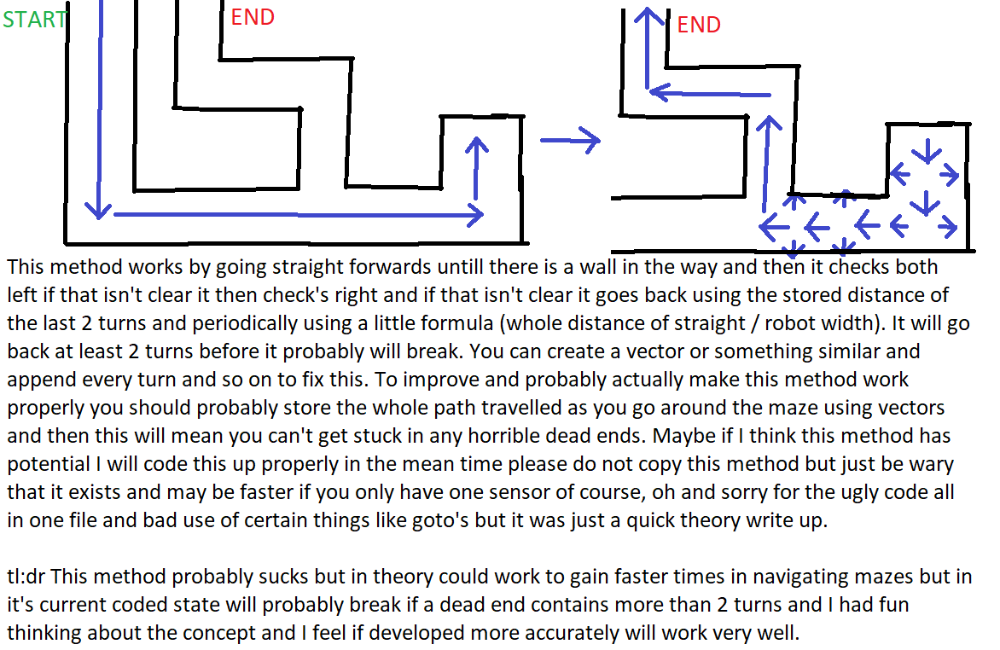

# hinge-bot
small robot using an arduino uno, this branch is just a concept I came up with to navigate mazes. This is just a concept which is also explained below kind of well I guess with my bad paint skills. There is definately room for error and this has not been tested atl all just written up quickly by me so we can try it out and modify it to try and get a better completion time for the mazes.

